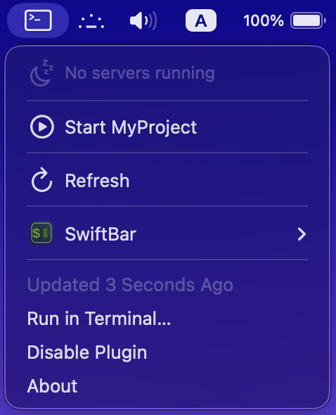

# Pavel's SwiftBar npm Scripts

Monitor and control all your npm dev servers from the macOS menu bar.




## Quick Start

1. Install [SwiftBar](https://github.com/swiftbar/SwiftBar): `brew install swiftbar`
2. On first launch, SwiftBar will ask you to choose a **Plugin Folder**
3. Copy `npm-dev-server.5s.sh` to your Plugin Folder
4. Configure the script (see below)
5. Make it executable: `chmod +x npm-dev-server.5s.sh`

## Configuration

Open `npm-dev-server.5s.sh` and edit the **CONFIGURATION** section:

```bash
# ===== CONFIGURATION =====
# Change this to your project path:
PROJECT_PATH="$HOME/projects/my-app"
DEV_COMMAND="npm run dev"
CPU_WARNING_THRESHOLD=80
MEMORY_WARNING_THRESHOLD=500
# ===== END CONFIGURATION =====
```

**Important:** Set `PROJECT_PATH` to the full path of your npm project.

## Features

* **Auto-Detection** — Finds ALL running node servers on your machine
* **Resource Monitoring** — Real-time CPU% and memory usage per server
* **One-Click Actions** — Start, stop, or force-kill servers from the menu
* **Quick Access** — Click any server to open `localhost:PORT` in browser
* **Warning Indicators** — Alerts for high CPU/memory or stuck processes
* **Minimalist Design** — Clean monochrome SF Symbols

## Menu Structure

**When idle:**
```
⌘                              ← Terminal icon
───
  No servers running
───
▶ Start my-app                 ← Click to start
───
↻ Refresh
```

**When servers running:**
```
⌘ 2                            ← Count badge
───
✓ my-app :3000                 ← Click to open in browser
   2.1% CPU · 125MB
   /path/to/project
   ───
   ⏹ Stop
   📄 Logs
───
▶ Start my-app
───
↻ Refresh
```

## Files

- `npm-dev-server.5s.sh` — Main plugin
- `~/.npm-dev-server/` — Runtime data (logs, PIDs)

## Customization

Rename the file to change refresh rate:
- `npm-dev-server.30s.sh` = 30 seconds
- `npm-dev-server.1m.sh` = 1 minute

## Troubleshooting

### Server won't start
- Verify `PROJECT_PATH` points to a valid npm project
- Test manually: `cd /your/project && npm run dev`
- Check logs: `cat ~/.npm-dev-server/servers/*.log`

### Server not detected
Only `node` processes listening on TCP ports are detected:
```bash
lsof -iTCP -sTCP:LISTEN -n -P | grep node
```

## License

MIT
